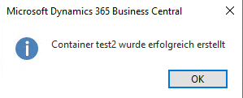

# Documentation

## Setup Azure Blob Storage Accounts
The first step is to set up the Azure Blob Storage accounts. The setup is done via the Page 50000 Azure Blob Storage accounts.

The following fields must be filled in on this page:
1. Code
2. Path
3. Storage Account Name
4. Shared Access Key

## Set Container Name
The system allows values to be entered manually in the Container Name field. There is also an Assist Edit, which opens a list of containers and allows you to make a selection.

# Buttons

* Authentifizierung testen = Test Authentication
* Container anzeigen = Show Containers
* Container erstellen = Create Container
* Dateien anzeigen = Show Files
* Datei hochladen = Upload File

## Test Authentication
This Buttons tests if your credentials are working by trying to fetch a list of containers. If this call is successful a message will pop up otherwise an error.

## Show Containers

## Create Container

## Show Files

## Upload Files

